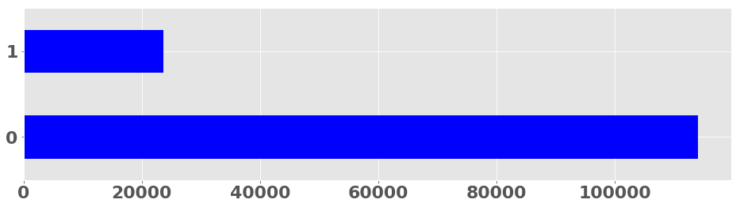
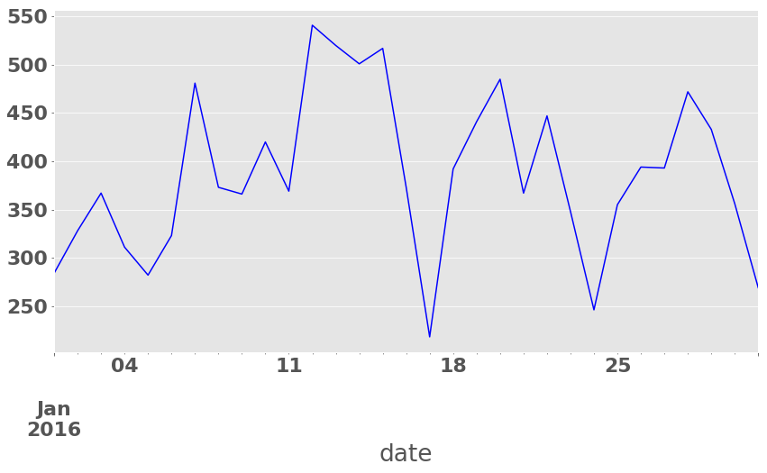
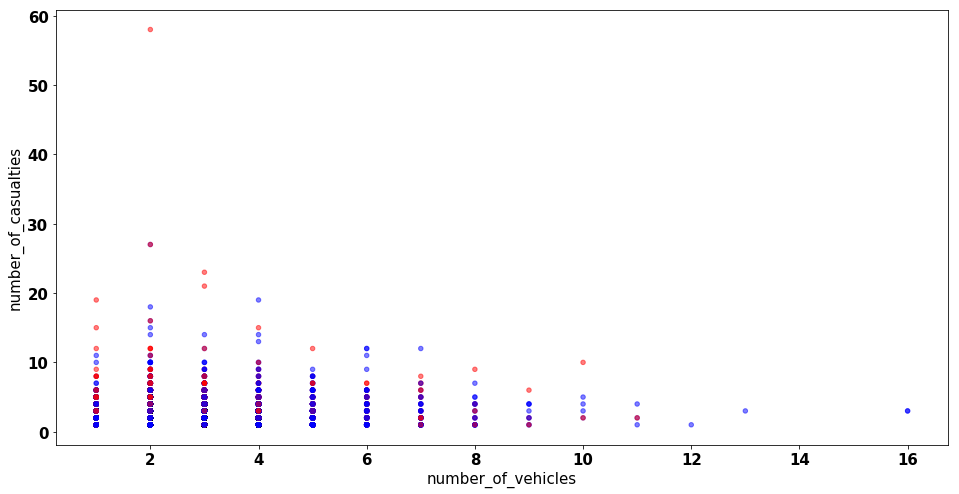
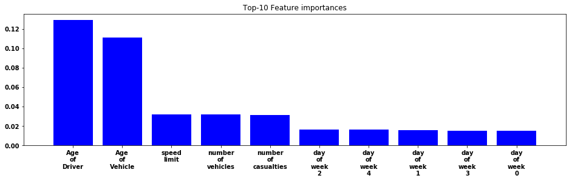
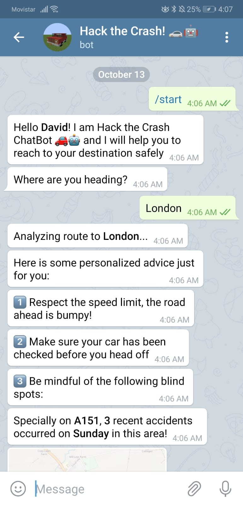
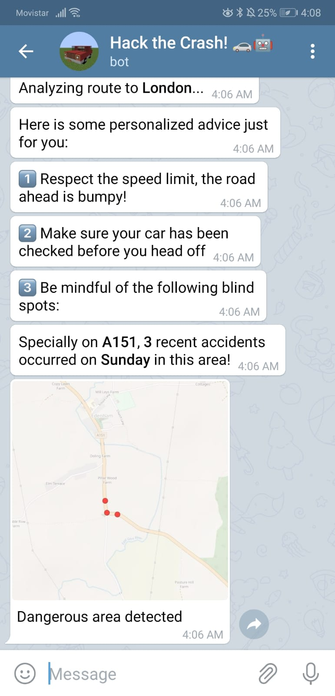

# McKinsey & Company: Hack the Crash! at HackUPC 2019

Insighters Hack the Crash! at HackUPC 2019

We developed a Machine Learning pipeline to predict accident severity and a ChatBot that provides bite-sized advice to drivers!

* Slides: [Insighters Hack the Crash at HackUPC 2019](https://docs.google.com/presentation/d/1sK5sU6ylB1pbYWWhIcHx5wlWGj2-LtTnmiU1Fhd6T_Y/edit?usp=sharing)
* YouTube: [Video](https://www.youtube.com/watch?v=fVg1szW6j-s)

## Motivation

Rate of road-accidents and fatality in the UK is very high

This challenges focuses on predicting accident severity based on the following parameters:
* Road location
* Road type and its speed limit
* Weather conditions
* Details of vehicles involved in the accident
* and many more!

Predicting accident severity will help the authorities closely monitor accident prone road segments and do a root cause analysis for such mishaps

## Data

| Accident training data | Vehicle data |
| :-------------: | :-------------:|
| 137,599 | 455,652 |

## Notebooks

1. Exploratory Data Analysis: EDA by looking at all the fields and their values
   * [Accidents](src/notebooks/1.%20Exploring%20Accidents.ipynb)
   * [Vehicles](src/notebooks/1.%20Exploring%20Accidents.ipynb)
   * [Test](src/notebooks/1.%20Exploring%20Accidents.ipynb)
2. Data Wrangling:
   * [Data Clearning & Conversion](src/notebooks/2.%20Convert%20vehicles%20data%20to%20text%20III.ipynb) 
3. Data Summarization:
   * [Correlations & Scatter plots](src/notebooks/3.%20Correlations%20%26%20Scatter%20plots.ipynb)
   * Data Distributions
4. [Feature Engineering](src/notebooks/4.%20Features%20II.ipynb): handcraft a bunch of features from the fields
5. Feature Selection & Dimensionality Reduction: PCA, tSNE, UMAP
6. [Split the data](src/notebooks/5.%20Split%20Train%20and%20Val%20sets.ipynb): split the dataset into Train and Validation sets
7. [Modelling a classification model](src/notebooks/6.%20Modelling.ipynb):
   * Model a Random Forest classifier and analyse the power of their features
   * Transform the text of the information regarding the accident and the vehicles involved using NLP techniques such as [TF-IDF](src/notebooks/6.%20Modelling%20with%20TF-IDF.ipynb) & [Embeddings](6.%20Modelling%20with%20Embeddings.ipynb)
   * Ensembling our individual models
8. Ablation studies: fitting a Linear Regression model and running ablation studies to measure the variance explained by the features
9. Mutual Information Exploration: measuring the mutual information (mutual dependence between two variables) of each of the features we figured as important (based on the ablation study) and the precision mark.
10. [Hyper-parameter tuning](7.%20Hyper-parameter%20Tuning.ipynb): tune the model

You can always view a notebook using https://nbviewer.jupyter.org/

## Technologies

* [Python 3](https://www.python.org/)
* [Docker](https://www.docker.com/)
* [keras](https://keras.io)
* [tensorflow](https://www.tensorflow.org/)
* [numpy](http://www.numpy.org)
* [pandas](https://pandas.pydata.org/)
* [matplotlib](https://matplotlib.org/)
* [scikit-learn](https://scikit-learn.org/)
* [pillow](https://pillow.readthedocs.io/)
* [jupyter](https://jupyter.org/)
* [Telegram](https://telegram.org/)
* [Python Telegram Bot](https://github.com/python-telegram-bot/python-telegram-bot)

## Figures

**EDA**: Exploring the target variable:

**EDA**: Daily Accidents in January:

**Scatter**: Vehicles vs Casualties:

**Random Forest**: Forest Importances:

**ChatBot**: Bite-size driving advice:

